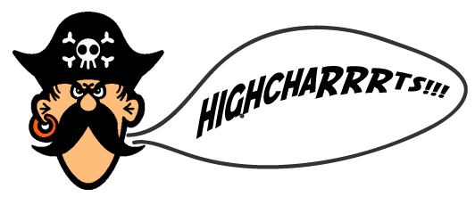

# highChaRRRts
_generate interactive plots in AAAARRRRRRRR_ <br/>
[a csv soundsystem joint](http://www.csvsoundsystem.com/)
============

<p>An R package to create interactive HighCharts in JavaScript from a dataframe. You'll want to use dcast in the reshape2 package to format it nicely. (more on that: [http://www.cookbook-r.com/Manipulating_data/Converting_data_between_wide_and_long_format/](http://www.cookbook-r.com/Manipulating_data/Converting_data_between_wide_and_long_format/))</p>

<<<<<<< HEAD
<p>Currently supported chart types: bar, line, area, column.<p>
<p>Chart types to come: scatterplot and others</p>
## Install the package

```
library("devtools")
install_github("highChaRRRts", "csvsoundsystem")
library("highChaRRRts")
```

## Basic usage

```
highChaRRRts(dcasted_df)
```

<p>Then in your console, cd to the directory it just created, default name "highChaRRRt". Then create a simple web server such as</p>
```
python -m SimpleHTTPServer
```
<p>Then point your browser to 0.0.0.0:8000</p>

## All options

```
highChaRRRts(dcasted_df, chart_type, x_axis_label, y_axis_label, output)
```

## So...

```
highChaRRRts(df, chart_type = "line", x_axis_label = "Months", y_axis_label = "Temperature", output = "chart_output")
```

## More options
<p>If you have the ColorBrewer package installed, you can pass it a name of the color set you want to use</p>

```
highChaRRRts(dcasted_df, chart_type = "line", x_axis_label = "Months", y_axis_label = "Temperature", output = "chart_folder", pal="RdYlBu"
```
